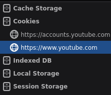
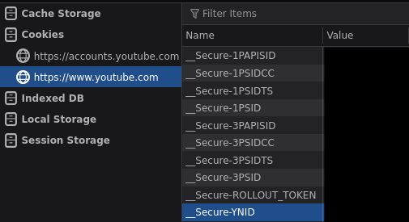

# Authentication and Cookies

## Tools
- Kali Linux 
- Web Developer Tools

## Key Terms
- Authentication 
  - proving the user's identity
  - asking for the password before letting you in
  - checking the session cookie
- Cookie
  - The website doesn't remember you after you logged in, so it gives you cookie for that session.
  - The browser sends it every request and the server checks it.
  - It allows you to do something on your account without re-entering your credentials

## Actions Performed

## 1. Visit a website

## 2. Log in

## 3. Open DevTools

- Press F12 or Right-Click then Inspect
- Go to the gear icon at the top right portion of the tab
- Check persist logs

## 4. Look for cookies

- Go to the storage tab

- on Cookies dropdown, select the website

- These are the session cookies for youtube.
- The values are used by the browser to prove the user's identity.
- Whoever can show a session cookie to the server will be treated as the user, as the server has no way of identifying the real user and the attacker.
