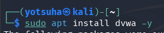
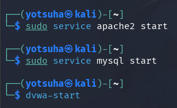

# Security Misconfiguration

## Tools
- Kali Linux Virtual Machine
- Damn Vulnerable Web Application (DVWA) - a web application for training and testing tools for cybersecurity
- Apache - a web server
- MySQL -  a database engine
- apt - (Advanced Package Tool) - tool for software installation and updates
- sudo - root access

## Key Terms
Security Misconfiguration 
- instances that developers leave their applications, databases, and websites vulnerable

Default Credentials
- pre-set usernames and passwords for initial setup

## Actions Performed
1. Find software updates
2. Install DVWA
3. Run DVWA
4. Enter default credentials
5. Create database
6. Log in

--- 

## 1. Find software updates

- run `sudo apt update`
  - update - search for software updates
- This is to find the latest versions of DVWA

## 2. Install DVWA

- run `sudo apt install dvwa -y`
  -  `-y` - say yes automatically

## 3. Run DVWA

- sudo service apache2 start
  - to host dvwa, as a web application, locally
- sudo service mysql start
  - the database engine where dvwa stores and retrieves its and the user's resources.
- dvwa-start
