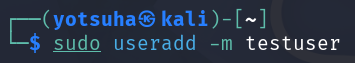
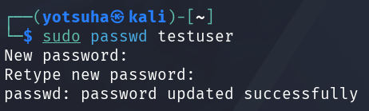
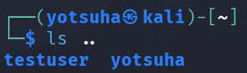
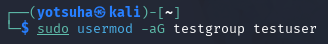
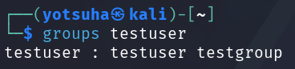
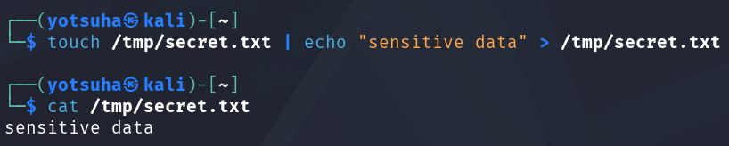
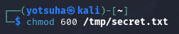
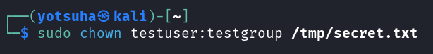
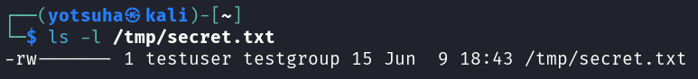

# Users, Groups, Permissions, and the Filesystem

## Objectives
- Review Linux user/group model (root, sudoers, regular users)
- Read and understand /etc/passwd and /etc/shadow
- Create a test user, assign groups, set permissions on a file, verify with ls -l

## Key Terms
- User/Group model - every file has an owner and a group
- root - the superuser, can do anything in a filesystem
- sudoers - superuser doers, users that gain root access
- regular users - can only do what they are allowed to do in a filesystem
- Permission Triplets
  - rwxrwxrwx = owner/group/everyone else
  - r = read, w = write, x = execute
- `/etc/passwd` - a world-readable list of user information
- `/etc/shadow` - a root-only list of user passwords

## Commands
- `sudo useradd -m` - creates a user and its directory
- `sudo groupadd` - adds a group
- `sudo usermod -aG` - adds the user to a group without removing him from other groups
- `sudo chown` - change the owner of a file
- `ls -l` - list the files in a long list format
- `grep` - search for words in a file
- `touch` - create a file
- `echo` and `>` - write a text on a file
- `cat` - read a file

## Hands-on Activities
1. Add a user and assign its password
2. Assign the user to a group
3. Create a file, set its permissions, and change its owner
4. Read passwd and shadow
5. Check a file that has a SUID

### Add a user and assign its password
Commands: 
- `sudo useradd -m testuser`
- `sudo passwd testuser`
- `ls ..`

### Assign the user to a group
Commands: 
- `sudo groupadd testgroup`
- `sudo usermod -aG testgroup testuser`
- - `groups testuser`

### Create a file, set its permissions, and change its owner
Commands:
- `touch /tmp/secret.txt`
- `echo "sensitive data" > /tmp/secret.txt`
- `cat /tmp/secret.txt`
- `chmod 600 /tmp/secret.txt`
- `sudo chown testuser:testgroup /tmp/secret.txt`
- `ls -l /tmp/secret.txt`

