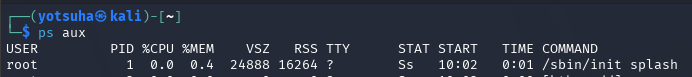
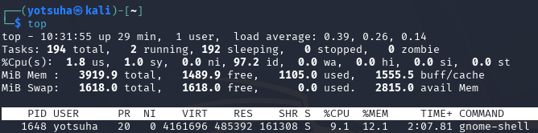
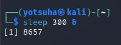
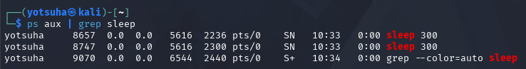
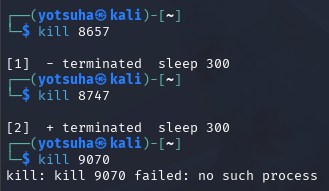

# Processes and Services

## Objectives
- Define process and service.
- Look for processes and services.

## Terms
- Process - a running program
- PID - process ID, a unique identifier for a process
- Service - a running process in the background
- Daemons - background services in linux that aren't directly controlled by the user
- Port - a doorway where services "listen"
- Listening port - a service waiting for connections over a network

## Commands
- `ps aux` - show a snapshot of proceeses
- `top` - show real-time processes
- `sleep 300`  - a process that puts itself to sleep for 5 minutes
- `ps aux | grep sleep` - shows sleeping processes
- `kill [PID]` - terminates a process
- `kill -9 [PID]` - forcely terminates a process 
- `ss -tulnp` - shows listening services
 
## Actions

--- 

## Search for Processes
Command: `ps aux`
- `a` - show processes for all users
- `u` - show user-friendly columns/categories (e.g. %CPU)
- `x` - show processes not tied to a terminal

- /sbin/init, the startup display, splash is the first process executed by Linux

- ps aux is the last process
- That makes sense since the commands theirselves are processes.

## Show Live Processes
Command: `top`
- Tap:
  - `P` - filter by CPU usage
  - `M` - filter by Memory usage
  - `x` - exit
 

- The current most memory and CPU consuming process is gnome-shell, the graphical user interface of my GNOME desktop environment.

## Sleeping Processes
Command: 
- `sleep 300`
  - 300 - 300 seconds or 5 minutes
- `ps aux | grep sleep`
  - `|` - pipe, feeds the input of the first command to the next command
  - `grep sleep` - filter proceeses with the keyword sleep

- The first sleeping process's PID is 8657.
- Note: I've executed this command twice, so it is expected that there would be two sleeping processes.

- There are 3 sleeping processes:
  - The first and second `sleep 300` command.
  - The `ps aux | grep sleep` command itself.
 
## Terminate Sleeping Processes
Command: 
- `kill [PID]`
  - equivalent to the default `kill -15 [PID]`
  - uses SIGTERM
  - asks the process to terminate
  - can be ignored
-  `kill -9 [PID]`
  - uses SIGKILL  
  - cannot be ignored

- The two sleeping processes are terminated.
- The last process repeatedly changed PID when I try to terminate it.
- I realized that it is the `ps aux | grep sleep` command itself, and it immediately terminated itself after it executed.
- So, they didn't change PIDs, they are different processes.

## Show Listening Ports
Command: 
- `ss -tulnp`
  - t - show services that use tcp 
  - u - show services that use udp
  - l - show listening ports
  - n - show port numbers
  - p - show process
  

- There are no listening ports on my virtual machine.
