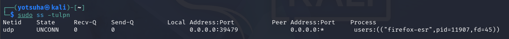
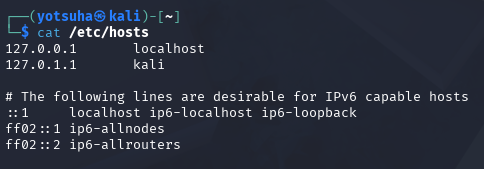
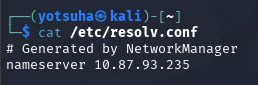

# Attack Surfaces

## Objectives
- Identify what is an attack surface.
- Identify what is `/etc/hosts` and `/etc/resolv.conf`.

## Term
- Attack Surface - an opening where attackers can enter and mess with a system (e.g. open ports)

## Actions Performed

---

## Check Listening Ports
Command: 
`ss -tulnp`
  - `t` - show services using tcp
  - `u` - show services using udp
  - `l` - show listening ports
  - `n` - show port number
  - `p` - show the process

- I've opened a browser to find out if a port opens.

- A service that uses udp that receives connection from my machine on 39479, a high ephemeral port.

## Learn what is /etc/hosts and /etc/resolv.conf
- What is `/etc/hosts`?

- This is where the OS checks first when you type a URL.
- When the domain name on the second column matches, the browser uses the IP address on the first column of the corresponding row immediately.
- Threat:
  - An attacker who has access to this can put a fake IP address for a legitimate domain name.
  - When you type the URL for that website, you'll be redirected at the fake server instead of the website.

- What is `/etc/resolv.conf`?

- This is where the OS checks next when the domain name isn't on `/etc/hosts`.
- This directory points at the DNS Resolver to be asked for.
- Threat:
  - An attacker who has access to this can put a fake DNS Resolver.
