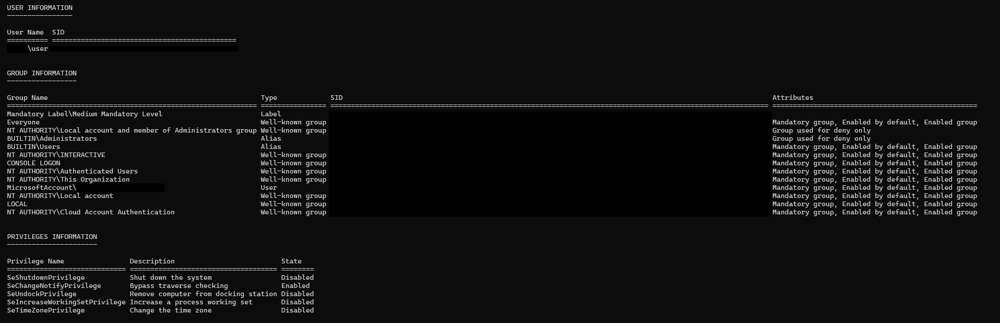
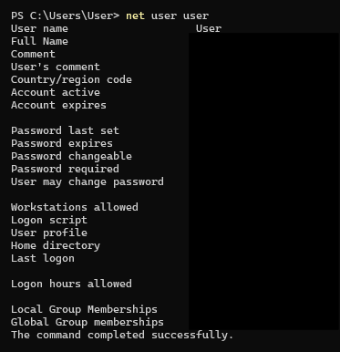
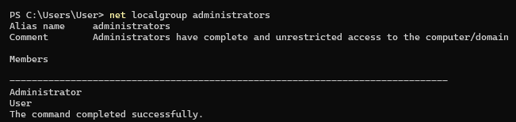

# User Account and Access Control

## Objectives
- Understand how Windows decide what I am allowed to do.
- Compare Windows Security to Linux's.

## Terms 
- Types of Windows Accounts:
  1. Local Account - exists only in the machine, stored in SAM
  2. Domain Account - managed by an Active Directory, used in corporate environments
  3. Built-in Accounts - pre installed accounts by the OS
     - Administrator - has the permission to do anything with the machine
     - Guest - can use the machine but cannot make changes on it
     - System - hidden account that is strictly used by the OS
- Security Account Manager (SAM)
  - a database for local accounts and passwords
  - is in `C:\Windows\System32\config\SAM`
  - equivalent of `/etc/shadow` in Linux
- Active Directory (AD) - a database for a network of computers
- User Account Control (UAC)
  - don't run anything as root
  - the pop-up that asks "Allow this app to make changes?" or "Allow this app to run as administrator?"
- Least Privilege - only give users and processes enough privileges to do basic tasks

## Commands
- `whoami /all` - shows the username, groups, and privileges information
- `net user [username]` - shows specific user information 
- `net localgroup administrators` - shows the groups who has the highest privileges

## Documentation

---

### User Account
Command: `whoami /all`

 

Observations:
- User Information:
  - User - my machine's name
  - Name - my username
  - SID - Security Identifier, a non-changeable String identifier
- Group Information:
  - All in default
- Privilege Information:
  - All in default I think since I didn't change any of these.
 
### User Information
Command: `user net user`

Observations:
- It shows the specifics about me and the machine.

### Group Admin
Command: `net localgroup administrators`

--- 

## Windows vs Linux Security

| Topic | Windows | Linux |
| --- | --- | --- |
| Account Information Storage | C:\Windows\System32\config\SAM  | /etc/passwd & /etc/shadow|
| Privilege Escalation | UAC | sudo |
| Strongest Account | System | root |
| Most Restricted Account | Guest | Unprivileged User |

- Both systems requires highest privileges to run a program or command that can view or alter critical information about the system.
- To do that, windows uses a pop-up interface (UAC) while Linux requires the user to run the command with sudo, in order to execute it a root.
- I didn't know that UAC is the program popping up everytime I install an application even though it is explicitly stated on the top of it.
