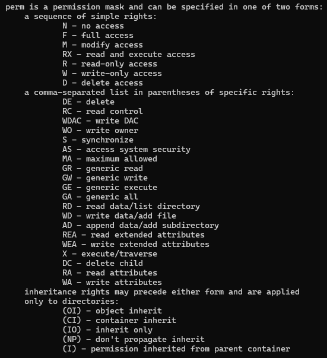
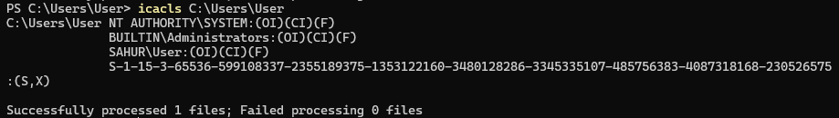
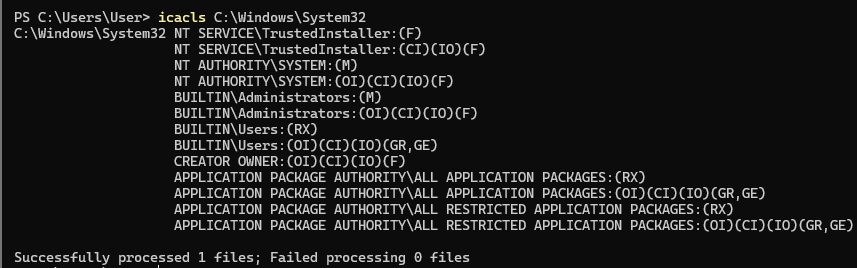
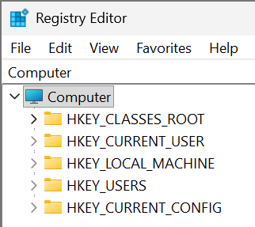
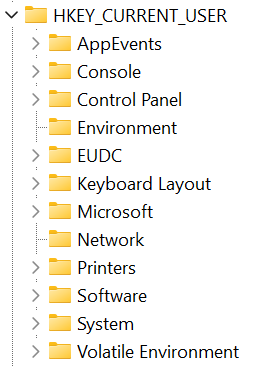
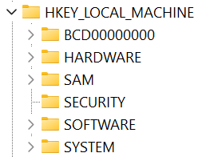

# Windows File and Permission System

## Objectives 
- Learn what is NTFS, ACL, HKLM, and HKCU.

## Terms
- NTFS - New Technology File System, file system of Windows that uses ACL
- ACL - Access Control List, permission system for Windows
- HKLM
  - Hive Key Local Machine
  - rules for the machine and all of its users
- HKCU
  - Hive Key Current User
  - rules for the current user

## Command
- `icacls "C:\Path\to\your\file"` - shows permission settings of a file or directory

## Actions

---

### My Permission Settings
Command: `icacls "C:\Users\User"`

- Me, the system, and administrators has full access in it.

### System Settings 
Command: `icacls "C:\Windows\System32`

- TrustedInstaller, System, and administrators has full access.
- Users can read and execute.

### HKLM and HKCU
- Open regedit (Registry Editor).

- HKCU
  - This can be configured by the user itself

- HKLM
  - can only be configured by the root

