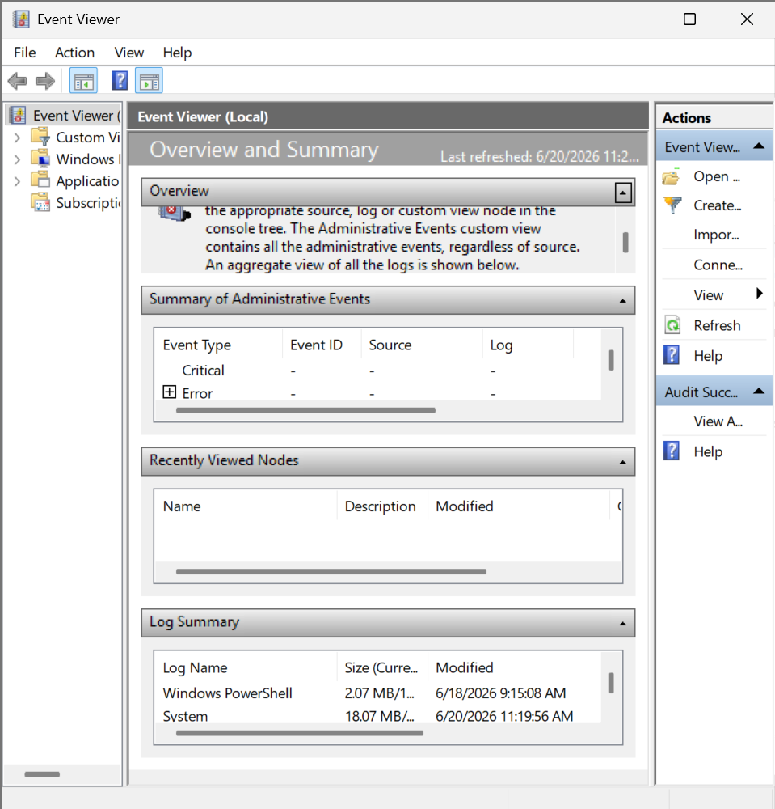
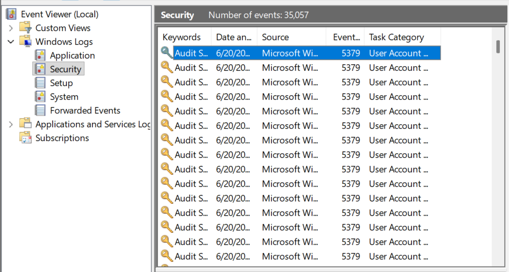
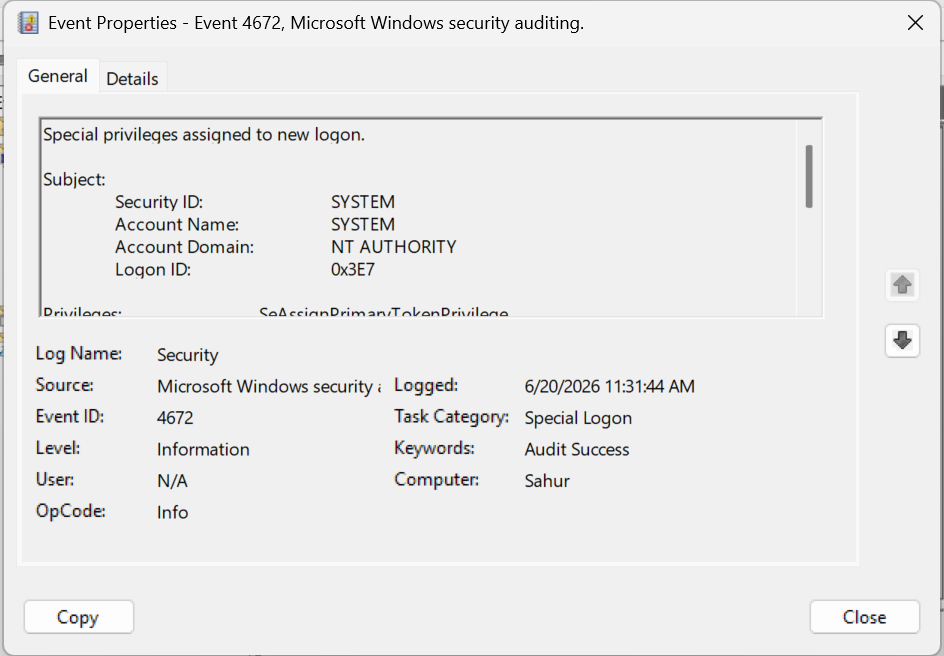
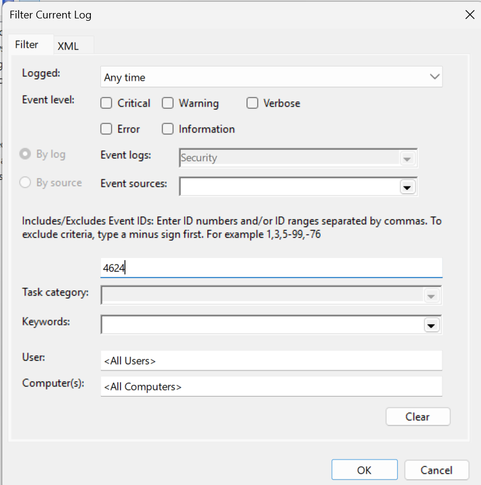
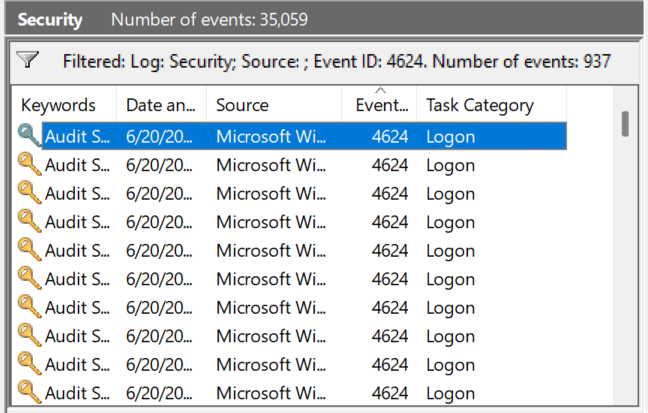
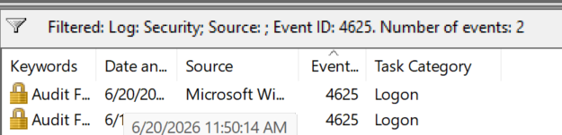
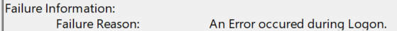

# Events and Services

## Objectives
- View events, firewall rules, and services

## Tools
- Event Viewer - shows logged events
- Services Viewer
- Windows Terminal

## Terms
- Event - anything that happened in your local machine
- Services - a process in the background

## Actions

---

### View Events
1. Press `Win` + `R`
2. Type `eventvwr.msc` and press `Enter`

- In the interface, you can see three panes; (1) Event Categories, (2) Details, and (3) Actions.

3. On categories, choose `Windows Logs` and then `Security`.

4. Click the most recent event.

- Event ID: `4672` - a user with administrator-level privileges logged on or performed an elevated action 

5. On Actions pane, click `Filter Current Log`

6. On the input field above `Task Category`, type `4624`.

- Event ID: `4624` - successful logon
- This will filter successful logins on your local machine.

7. Click the most recent log.

8. Below the logs, look for `Logon Type` on `Details`.

- Logon Type: `7` - a user unlocked a computer with a password

9. Filter logs with the Event ID, `4625`.

- Event ID: `4625` - failed logon

10. Click most recent failed logon and look for `Failure Reason` on details.

