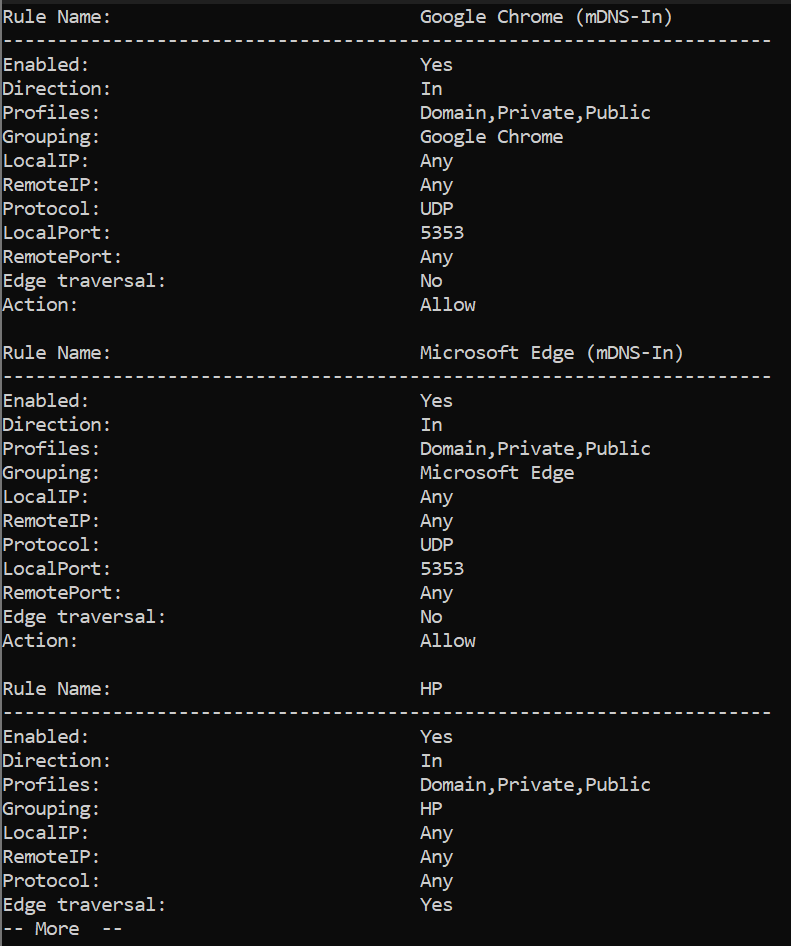
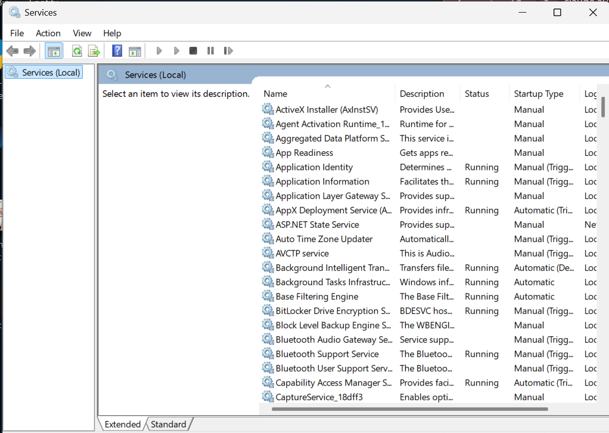

# Events and Services

## Objectives
- View events, firewall rules, and services

## Tools
- Event Viewer - shows logged events
- Services Viewer
- Windows Terminal

## Terms
- Event - anything that happened in your local machine
- Services - a process in the background

## Actions

---

### View Events
1. Press `Win` + `R`
2. Type `eventvwr.msc` and press `Enter`

- In the interface, you can see three panes; (1) Event Categories, (2) Details, and (3) Actions.

3. On categories, choose `Windows Logs` and then `Security`.

4. Click the most recent event.

- Event ID: `4672` - a user with administrator-level privileges logged on or performed an elevated action 

5. On Actions pane, click `Filter Current Log`

6. On the input field above `Task Category`, type `4624`.

- Event ID: `4624` - successful logon
- This will filter successful logins on your local machine.

7. Click the most recent log.

8. Below the logs, look for `Logon Type` on `Details`.

- Logon Types Encountered:
  - `5` - service account logon, not a real user
  - `7` - a user unlocked a computer with a password
  - `11` - a user with a microsoft account unlocked the computer

9. Filter logs with the Event ID, `4625`.

- Event ID: `4625` - failed logon

10. Click most recent failed logon and look for `Failure Reason` on details.

### View Firewall Rules
Command: `netsh advfirewall firewall show rule name=any dir=in | more
- `netsh` - open Windows network settings
- `advfirewall` - change/view security settings
- `firewall` - look at standard firewall rules
- `show rule` - display the rules in the screen
- `name=all` - show all rules in the system
- `dir=in` - show only rules going in the computer
- `| more` - fit the response in the screen, press `Space` to show more response

- This shows firewall rules for Microsoft Bingweather, Xbox, and an unnamed program in my system.

- This shows firewall rules for Google Chrome, Microsoft Edge, and HP in my local machine.
- Both Google Chrome and Microsoft Edge, browsers, uses local port 5353

### View Services
1. Press `Win` + `R`
2. Type `services.msc` then press `Enter`

3. To filter running services, click the `Status` column.

- In Linux, these are called Daemons, background processes that aren't directly controlled by the user.
