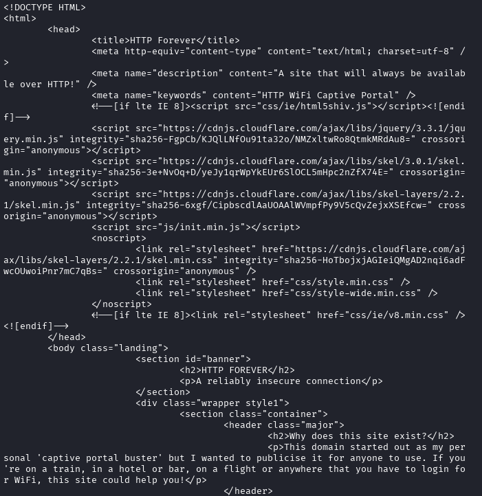

## CURL
- A command-line tool for tranferring resources.

1. Send a get request to an HTTP website.

- `-v` - verbose, see the details of the whole process

2. Analyze Results

Process Details
- the A and AAAA records of the website server has been returned at port 80
- failed to connect through IPv6, but succeeded using the IPv4 address

HTTP Request Details
- `>` - lines starting with this is the request
- GET / HTTP/1.1
 - GET - request web resources
 - / - from the root directory
 - HTTP/1.1 - using this HTTP version
- Host - the domain/website
- User-Agent - tool used to request resources
- Accept
 - */* - any type of media the website has

HTTP Response Details
- `<` - lines starting with this is the response
- HTTP/1.1 200 OK
 - 200 OK - means success, the server understood the request, found the resources, and sent it to me
- Server
 - nginx/1.18.0 (Ubuntu) - open-source web server and HTTP cache on Ubuntu OS
- Date - the exact date the response sent
- Content-Type - the type of media sent

The Body
- the data/web resource sent
- You can see the elements of the website on plain text
