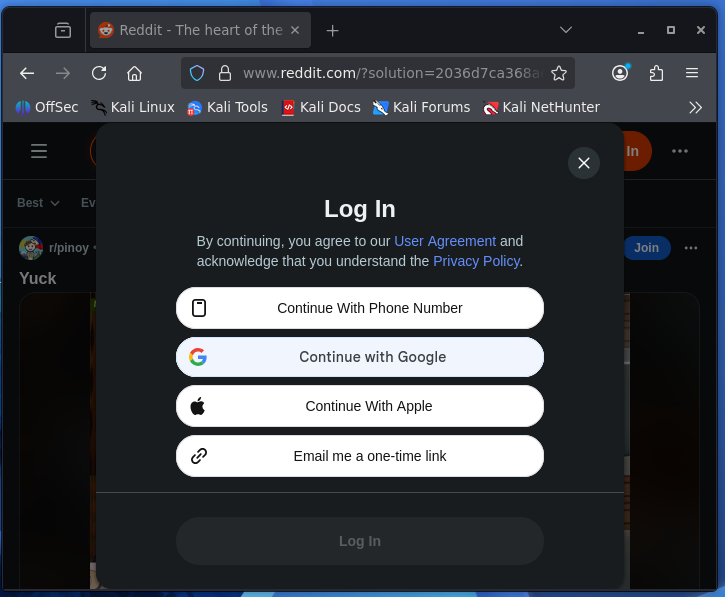
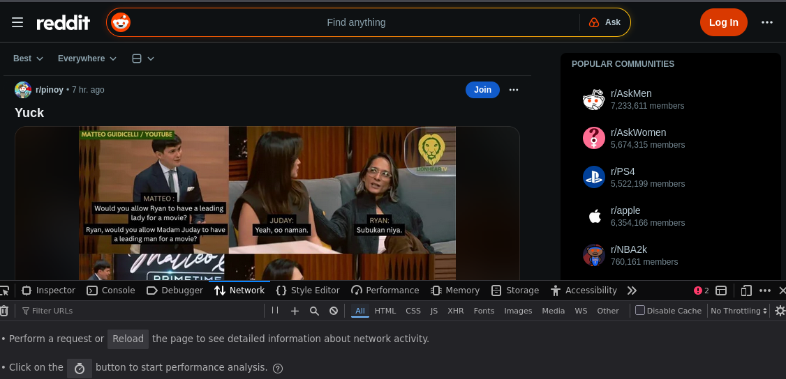
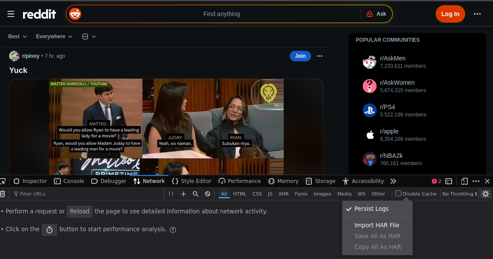
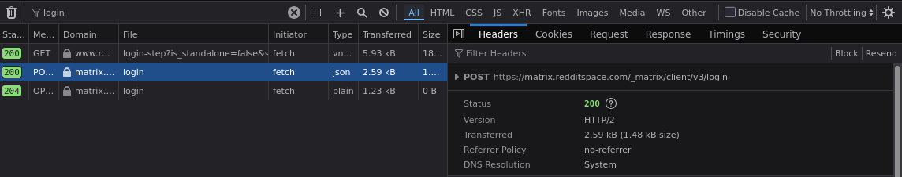
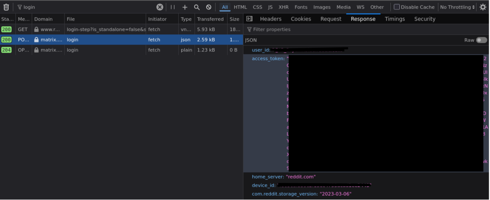
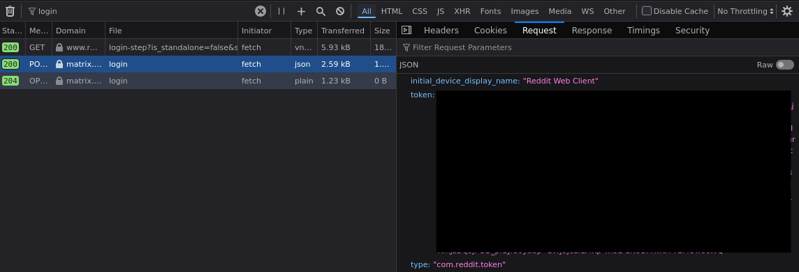
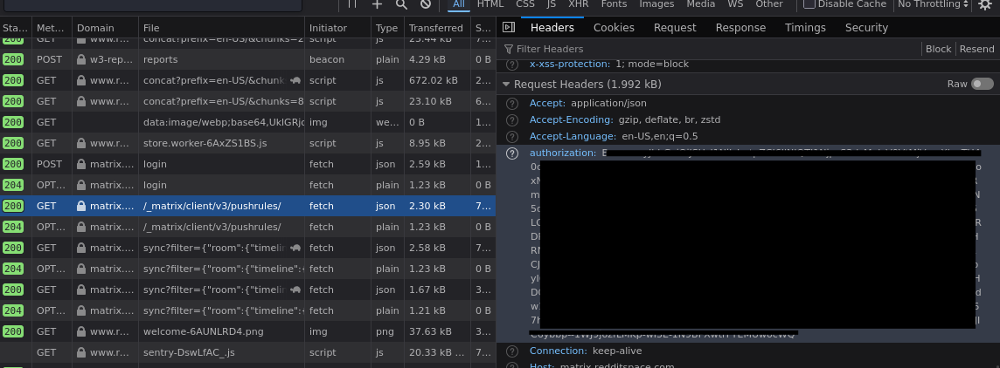
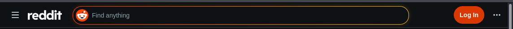
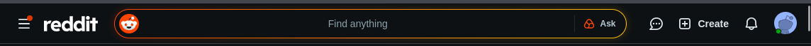

# HTTP & Web Fundamentals - Web Development Tools

## Tools
- Kali Linux Virtual Machine
- Web Development Tools
- Mozilla Firefox

## Objective
Read and analyze full HTTP exchange and cookies using web development tools without the browser summarizing it.

--- 

Actions Performed

---

1. Open a website

- I chose Reddit for this demonstration.

2. Open Web Developer Tools

Web Developer Tools 
- browser features that allows users to inspect HTML, CSS, JavaScript, and network activities.
- Press F12 or right-click -> Inspect to open 

3. Enable Persist Logs

Persist Logs 
- turn this on so that any logged network activities won't be cleared when the page refreshes
- Find the Gear Icon (Settings) at the top-right part of the webdev tools window, then check Pesist Logs

4. Log in

- Log in to the website
- Go to Network tab in webdev tools window
- Find the login file with a POST method
- That is the server's response to your log in request
- 200 means the server understood your request and let you in the website with your account

5. Find the access token

- Go to the Response tab
- You will see user_id and session_token
- user_id is the permanent, unique identifier of your account
- session_token
  - a temporary, unique string that serves as a key to your current session
  - it lets you do things without re rentering your credentials

- you can also see the token at the Request tab

6. Find a GET method 

- Find a GET method after the login POST
- Find the Request Headers at Headers Tab of the selected json file
- The string at authorization is the same as the session_token at the POST method
- What does that mean?
  - The session_token serves as the key for the browser to prove to the server that it is really the user.
  - Whoever holds the token will always be identified as the user.
 
---

How important is the session token/cookies?

---

Let's answer that by demo:

- I opened a private window and visited the same website.
- Copied the session_token
- Injected it in the storage tool
- Refreshed the page

- Voila! I logged in without actually logging in
- This is called session hijacking, where an attacker steals your session cookies and pretends as the victim
