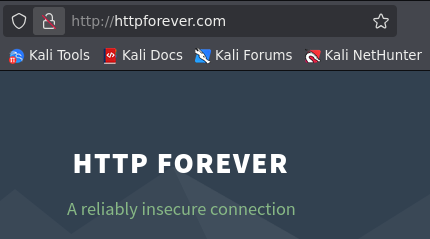
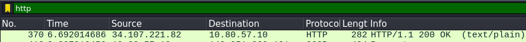
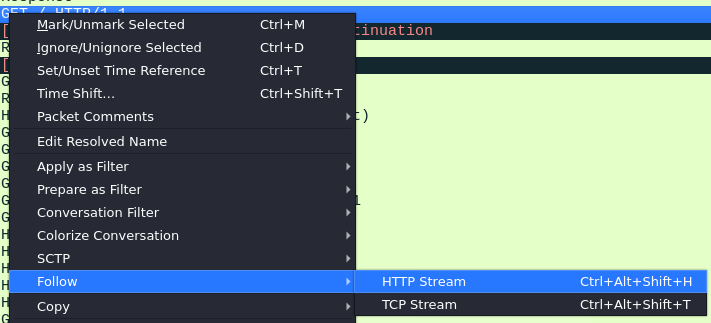
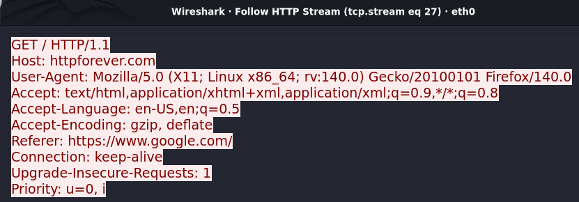
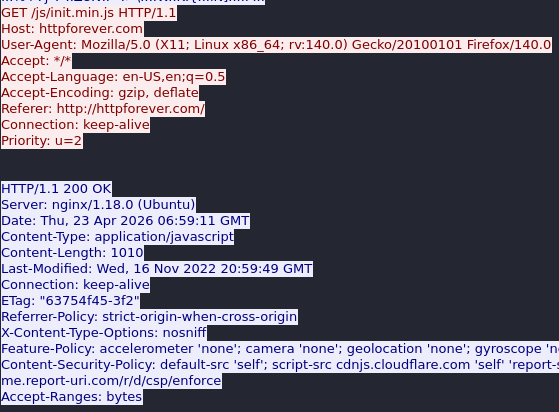

# HTTP & Web Fundamentals - Wireshark

## Tools
- Kali Linux Virtual Machine
- Wireshark

## Objective
Read a full HTTP exchange using Wireshark without the browser summarizing it.

--- 

##  Actions Performed

---

1. Open an insecure website via a browser.

- HTTP Forever is an intentional insecure website.
- Use your own safe network or use VPN!
  
2. Capture HTTP traffic

- Filter HTTP traffic
3. Follow HTTP Stream
  

- Look for the GET / HTTP/1.1
  

- Right-click the packet, select Follow, and then HTTP Stream.
  

- Voila! The whole HTTP communication in a window.
- After the first HTTP request header, there are encrypted-like lines of data. However, through research, I've found out that it's binary data.
  
4. HTTP Communication Analysis

- GET method - the client is requesting web resources
- Host: httpforever.com
  - This is the server, where the client requested resources from
    

HTTP Request
- GET /js/... - the client requests for JavaScript files
- User-Agent - refers to the tool used for requesting resources
  - Gecko - open-source layout engine of Firefox
  - Firefox/140.0 - the browser with its version 
- Accept
  - */* - accepts anything the website/server has
 
  
HTTP Response
- 200 OK - the process is successful
- Server
  - nginx - an open-source HTTP server
  - 1.18.0 - nginx version
  - Ubuntu - the Operating System of the server
- Date
  - the exact timestamp of the response
  - the time isn't local time
- Content-Type - the type of resources sent

There's another HTTP request for CSS but it didn't get a response.
