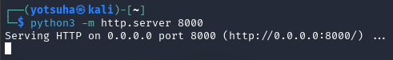
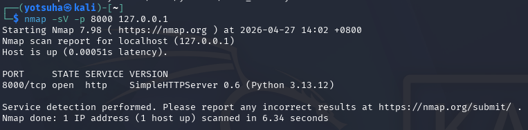
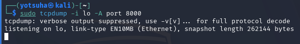

# HTTP & Web Fundamentals - Probing, Forging, and Intercepting

## Objectives
- Discover, manipulate, and observe HTTP communication.
- Find what's running, forge requests the server didn't expect, and watch the raw traffic in transit.

## Actions Performed

---

## 

1. Run a local web server

- run a local web server at port 8000
- use another terminal to execute commands

2. Verify the server

- scan the server (IP address: 127.0.0.1 (loopback), Port: 8000)
- A SimpleHTTPServer version 0.6 using Python 3.13.12

3. Sniff traffic on the server

- sudo - root privileges
- tcpdump - real-time packet capturer and traffic analyzer
- `-i lo` - listen to my own machine, where the server is
- `-A` - print the data in ASCII format
- port 8000
- keep it running

