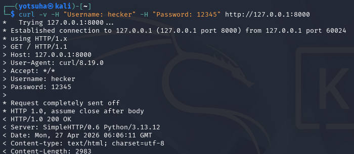
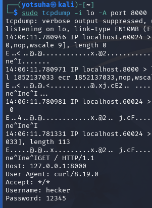
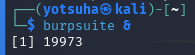
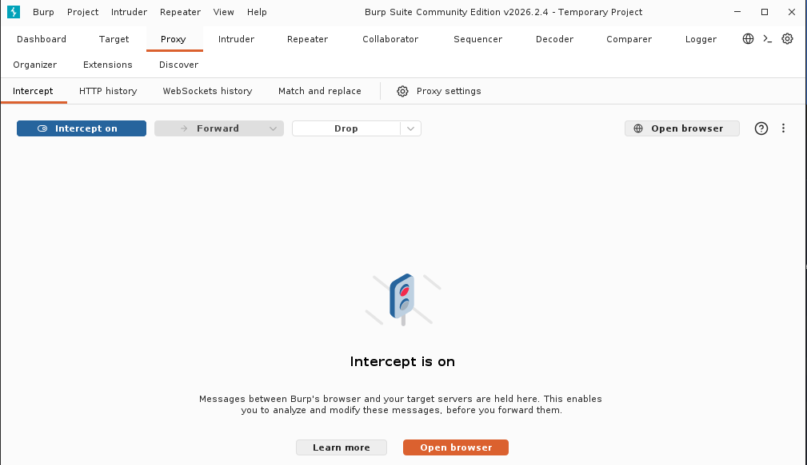
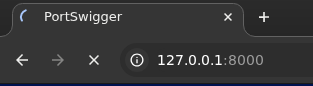
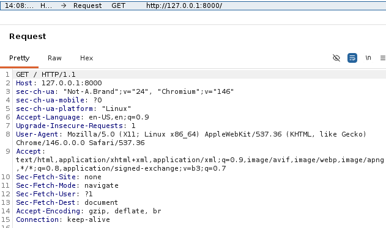
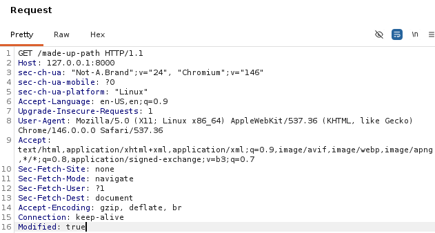
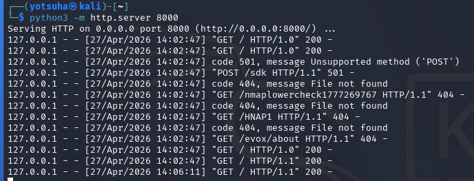

# HTTP & Web Fundamentals - Probing, Forging, and Intercepting

## Objectives
- Discover, manipulate, and observe HTTP communication.
- Find what's running, forge requests the server didn't expect, and watch the raw traffic in transit.

## Tools
- Kali Linux Virtual Machine
- python3 - a programming language that can be used for scripting
- nmap - a tool for network scanning
- curl - command-line tool for transferring resources on servers
- tcpdump - real-time packet capturer and traffic analyzer
- Burpsuite - a tool that can intercept traffic between a client and a server

## Actions Performed

---

## Sniff HTTP Traffic 

## 1. Run a local web server

- run a local web server at port 8000
- keep it running and use another tab to execute commands

Target:
- Loopback address: 127.0.0.1
- Port: 8000

## 2. Verify the server

Command:
- nmap
- `-sV` - version scan
- `-p` - specify port

Result: 
- Scans the target 
- A SimpleHTTPServer version 0.6 using Python 3.13.12

## 3. Set traffic sniffer

Command:
- sudo - root privileges
- tcpdump 
- `-i lo` - listen to my own machine, where the server is
- `-A` - print the data in ASCII format
- keep it running to capture the real-time traffic in the server and use another tab to execute commands

## 4. Add Header

Command: 
- curl 
- `-v` - detailed output
- `-H` - add header

Observation:
- The added headers appeared at the end of the Request, a username and password.
- 200 OK -  the request was received and understood by the server

## 5. Check Traffic

- Go back to the tcpdump tab
- If you find the added headers, the curl command worked

Conclusions:
- A packet sniffer can see traffic in plain text if the server uses HTTP to transfer web resources.

---

## Intercept Traffic 

## 1. Keep the server running

## 2. Open Burpsuite

## 3. Intercept On

- Go to Proxy tab
- Go to Intercept sub-tab
- Turn Intercept on
- Click Open browser

## 4. Visit the server

## 5. Scan for the Request

- You can see the Request Header as usual with the GET method

## 6. Modify Request Header

- Modify paths or add headers
- Click Forward at the top of the logs
- Refresh the browser

## 7. Scan Server Logs

Observations:
- The modified Request is sent and logged
- Since the path is non-existent, the server returned 404 Not Found
- This can also be seen on the browser

---

## What does this mean?

- The action above is a type of Man-in-the-Middle Attack, where an attacker on the same network intercepts the communication between the client and the server.
- They can capture traffic.
- If the communication is over HTTP, the attacker can sniff the packet, steal credentials, or modify the content of the packets.
- So, if you logged in to an insecure website using an insecure network, like a public WiFi, you should know that you are giving away your credentials for free.
