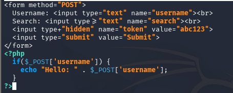
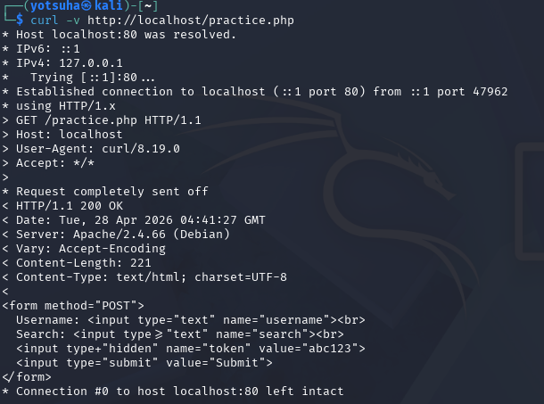

# HTTP & Web Fundamentals - Potential Attack

## Tools
- Kali Linux Virtual Machine
- curl - a tool for transferring web resources
- apache - a web server
- nano - a terminal text editor for creating and editing files

## Objectives
- Create a vulnerable test server
- Use curl to read a web app's raw response like an attacker
- Find and document every input point
- Identify how each input could be exploited

## Actions Performed

---

## Create a Vulnerable Test Server

1. Check if apache is enabled
- run `sudo systemctl status apache`

2. Enable apache
- run `sudo systemctl enable apache`

3. Start apache
- run `sudo systemctl start apache`

4. Create a vulnerable test server
- run `sudo nano /var/www/html/practice.php`
- nano - create a PHP file
- /var/www/html - apache's store

Two Parts:
1. HTML code - content
  - Form method: POST (submission form)
  - Username and Search input fields
  - Hidden token value
  - Submit button
2. PHP code - operation
  - Print a greeting with the username

---

## Use curl to read a web app's raw response like an attacker

1. Send a Request to the server and show the details
  - run `curl -v http://localhost/practice.php`

2. Read the web app's Response
  - Request
    - retrieve practice.php from the server (localhost)
  - Response
    - Server returned 200 OK - the requested web resource is received, understood, and transferred by the server.

---

## Find and document every input point

1. Username Input Field
2. Search Input Field
3. A hidden token value

---

## Identify how each input could be exploited

1.1 Username input field
1.2 The client types the account's username on it through a POST method. After that, the website prints whatever the user put.
1.3 This is vulnerable to XSS, where an attacker injects a script on the input field. The script will get passed to the browser, treat it as a part of the server's web resources, and runs it.

2.1 Search input field
2.2 The client types a string through a submission form.
2.3 The input doesn't get processed, so it does nothing.

3.1 A hidden token value on the submission form.
3.2 It is dictated by the system and is in plain text.
3.3 I can steal this and hijack the session, since almost all websites use session token to do something on their without re entering their credentials.
