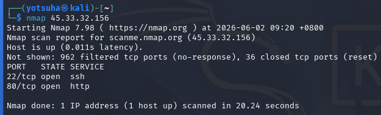
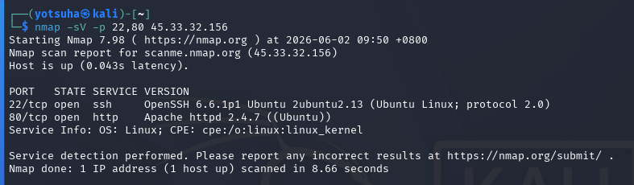

# Scanning vs Enumeration

## Objectives
- Define scanning and enumeration.
- Scan and enumerate a target.

## Tools
- Kali Linux Virtual Machine
- nmap - a powerful tool for scanning and enumeration
- scanme.nmap.org - a free testing ground for scanning

## Key Terms
1. Scanning
- checking for live hosts (host discovery) and open ports
  
2. Enumeration
- extracting the details about the services that the host is using

## Actions Performed
1. Scanning
Command: nmap 45.33.32.156
- Baseline Scan/Full TCP Scan
- 45.33.32.156 - IPv4 address of nmap.scanme.org (the host)

Observations:
1. The host is up.
2. 2 open ports: 22 and 80 - identified by convention as SSH and HTTP.
3. 962 filtered ports - blocked by a firewall.
4. 36 closed ports - no services listening.

2. Enumeration
Command: nmap -sV -p 22,80 45.33.32.156
- `sV` - service version scan
- `p` - scan specific ports

Observations: 
1. SSH version
  - OpenSSH 6.6.1p1
  - Released in 2014
2. Apache version
  - Apache httpd 2.4.7
  - Released in 2013
3. Both services are very outdated - older versions of any application have vulnerabilities/flaws that are patched in the newer versions.
