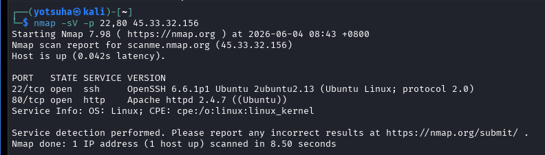
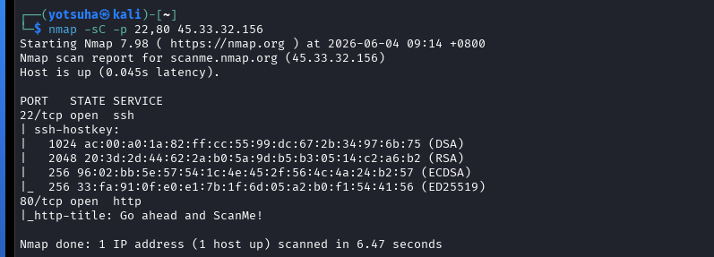

# Enumeration

## Objectives
- Perform enumeration on scanme.nmap.org.
- Use service/version and safe script scan.

## Tools
- Kali Linux Virtual Machine
- nmap - a powerful tool for scanning and enumeration
- scanme.nmap.org (45.33.32.156) - a legal testing site for scanning

## Actions Performed

### 1. Version Scan
Command: nmap -sV -p 22,80 45.33.32.156
- `-sV` - service version scan/--version-intensity 7
- `-p` - scan specific ports

Observations:
- OpenSSH 6.6.1p1 Ubuntu... - SSH connectivity tool used, its version, and its operating system
- Apache httpd 2.4.7... - http web server tool used, its version, and its operating system
- Both services are released more than a decade ago
- Both has vulnerabilities that can be exploited that aren't patched yet on that versions.

### 2. Maximum Version Scan
Command: nmap -sV --version-intensity 9 -p 22,80 45.33.32.156
- `--version-intensity` - adjusts how thoroughly Nmap does the service/version scan, from 0 as the lowest, 7 as default, and 9 as the maximum
- Analogy: A police interrogation, asking about the person of interests relatives and friends, checking their pockets, and asking them a lot of specific questions.

Observations:
- Same result as the default version scan.
- However, this will work well if the default version scan's answer is limited.

### 3. Safe Script Scan
Command: nmap -sC -p 22,80 45.33.32.156
- `-sC` - tells Nmap to perform safe, default scripts on the target
- Analogy: Going in the person of interest's house and checking the walls, mats, ceiling, and the table.

Observations:
- SSH Hostkeys - host identification
- HTTP Title - the website's title
- These specific details may gave away key details about the target.
