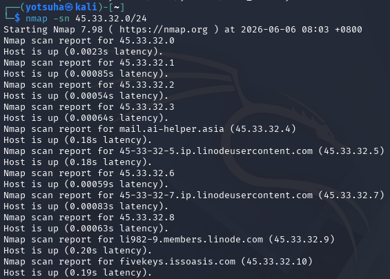
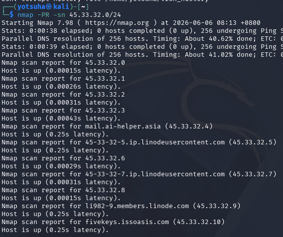

# Scanning and Enumeration

## Objectives
- Perform Host Discovery.
- Identify and perform ICMP ping sweep and ARP scan.

## Tools
- Kali Linux Virtual Machine
- nmap
- Network: 45.33.32.0/24

## Actions Performed
### 1. ICMP Ping Sweep
Command: nmap -sn 45.33.32.0/24
- `-sn` - ping scan
- This sends ICMP echo requests to all the hosts in a network, mapping live hosts by their echo replies.

Observations:
- It identified the active hosts on that network.
- All possible hosts on that network are up.

### 2. ARP Sweep
Command: nmap -PR -sn 45.33.32.0/24
- `-PR` - ARP ping, sends ARP requests instead of ICMP
- This maps a local network by sending broadcast requests of which device uses each IP address on that network.
- Analogy: In a classroom, it is a teacher checking for attendance by seat.

Observations:
- Gave the same result as the ping scan.
- Because this doesn't work remotely, the scan switched to ICMP ping scan.
