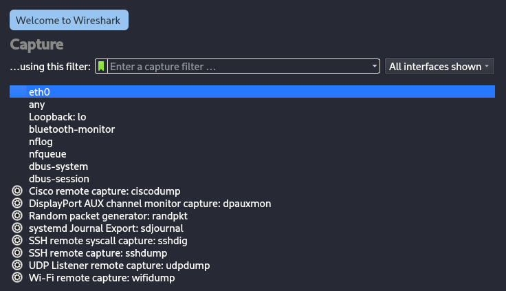
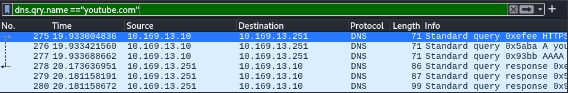

# Wireshark - DNS Query Analysis

## Operating System
Kali Linux

## Objective
Capture, identify, read, and inspect DNS query traffic.

--- 

## Actions Performed

--- 

## 1. Open wireshark and select target

## 2. Open a website

## 3. Filter DNS traffic

## 4. Query inspection

## 5. Response Analysis

