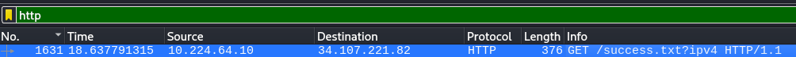
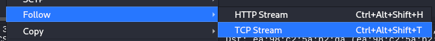
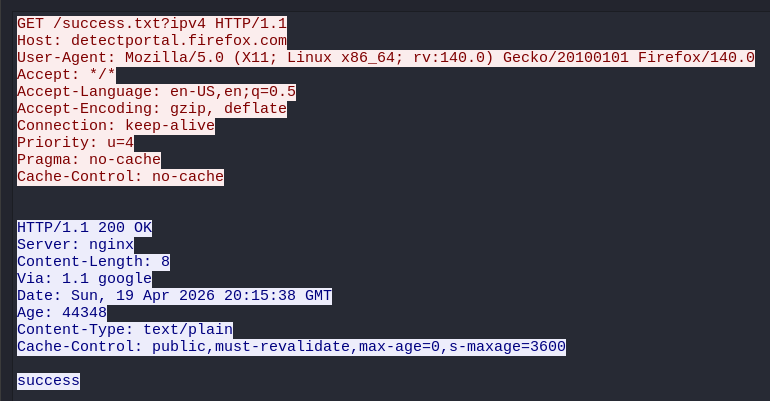

# Wireshark - TCP and HTTP Traffic

## Operating System 
Kali Linux

## Objectives
Capture, identify, read, and inspect TCP Handshake and HTTP traffic.

---
## Actions Performed
- TCP Handshake Analysis
   1. Capture traffic
   2. Get website server
   3. Capture and analyze TCP traffic
 
- HTTP Traffic Analysis
   1. Capture traffic
   2. Follow the stream
   3. Analyse the traffic

---
## TCP Handshake Analysis

## 1. Capture Traffic

1. Open wireshark and start capturing traffic.
2. Open a website briefly.
   

## 2. Get Website Server

- Since I couldn't find the TCP handshake traffic between my machine and YouTube, I looked for the DNS query A response and copied the returned IPv4 address.

## 3. Capture TCP Handshake Traffic

- Capture the traffic from the communication between my machine and the server, and then look for the TCP Protocol.
  

Observations:
- My machine have sent two SYN packets from two different high ports to 443 (HTTPS), initiating the connection twice.

  | Picture | Source Port |
  | -------- | -------- |
  |  | 60094 |
  |  | 60106 |

- Because the traffic was encrypted via HTTPS, I cannot read the contents of the packets.
- The server sent SYN-ACK packets, signaling that it was open for a connection for each of the SYN packets. My machine then sent an ACK for both of the responses, establishing the reliable, ordered connection between them.
- Afterwards, only one of the ports was used for the transactions.

---

## HTTP Traffic Analysis

## 1. Capture HTTP Traffic

- Use HTTP filter to find packets that used the HTTP protocol

## 2. Follow Stream

1. Right-click the http packet
2. Find "Follow" then click "TCP Stream" or "HTTP Stream"

## 3. Analyze HTTP Traffic

- I can see HTTP communication between my machine and an unkown IP address.

Observations:
- I can read the contents and process of the HTTP packets in a single window.
- First Packet (Peach font):
   - My machine have sent GET method request, which means that it is requesting to retrieve resources from the destination server.
   - The User-Agent is Mozilla, my browser.
- Second packet (Blue font):
   - The server responded with "200 OK", which means that the transaction was successful.
   - Server is nginx, an HTTP server.
