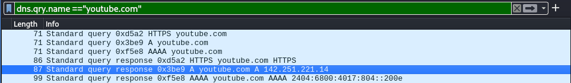
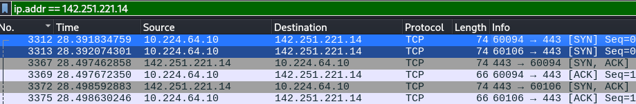
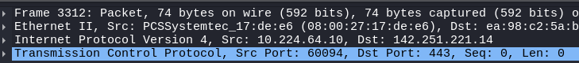
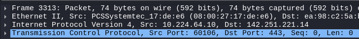

# Wireshark - TCP and HTTP Traffic

## Operating System 
Kali Linux

## Objectives
Capture, identify, read, and inspect TCP Handshake and HTTP traffic.

---

## 1. Capture Traffic

1. Open wireshark and start capturing traffic.
2. Open a website briefly.
   

## 2. Get Website Server

- Since I can't find the TCP handshake traffic between my machine and youtube, I've looked for the DNS query A response and copied the returned IPv4 address.

## 3. Capture TCP Handshake Traffic

- Capture the traffic from the communication between my machine and the server, and then look for the TCP Protocol.
  

Observations:
- My machine have sent two SYN packets from two different high ports to 443 (HTTPS), initiating the connection twice.

  | Picture | Source Port |
  | -------- | -------- |
  |  | 60094 |
  |  | 60106 |

- Since the TCP handshake traffic was in HTTPS, I can't read the contents of the packets.
- The server sent SYN-ACK packets, signaling that it is open for a connection, for each of the SYN packets and my machine sent ACK for both of the responses, establishing the reliable and ordered connection between them.
- Afterwards, only one of the ports was used for transactions.

