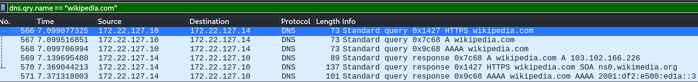
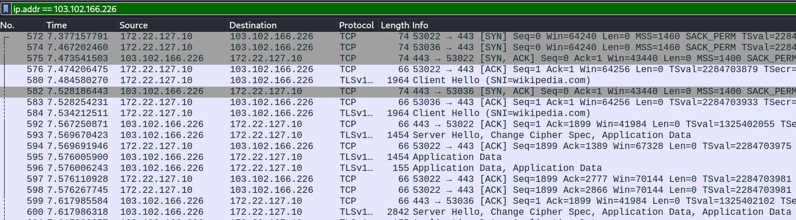
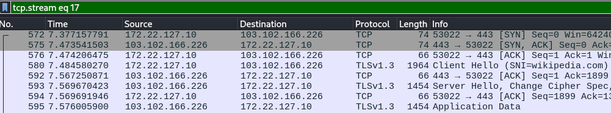

# Wireshark - HTTPS Traffic and the Full Process

## Operating System
Kali Linux

## Objective
- Capture and analyze HTTPS traffic.
- Enumerate the full process of opening a website.

---

## What happens when you open a website?

---

## 1. Open a website and capture the traffic

- Enter the website's URL.

## 2. DNS Lookup

DNS Lookup Process:
1. The browser asks the DNS resolver, router or default gateway, for the HTTPS, A (IPv4), and AAAA (IPv6) records of the website server.
2. Resolver returns the HTTPS, A, and AAAA records of the server.

Observations:
- The website that I am trying to enter is visible.
- The returned website server's IP addresses are visible.

## 3. TCP Handshake

The Web Traffic from Opening a Website

- Connections between the browser, from different ports, and server.

Filter connection from one source port

