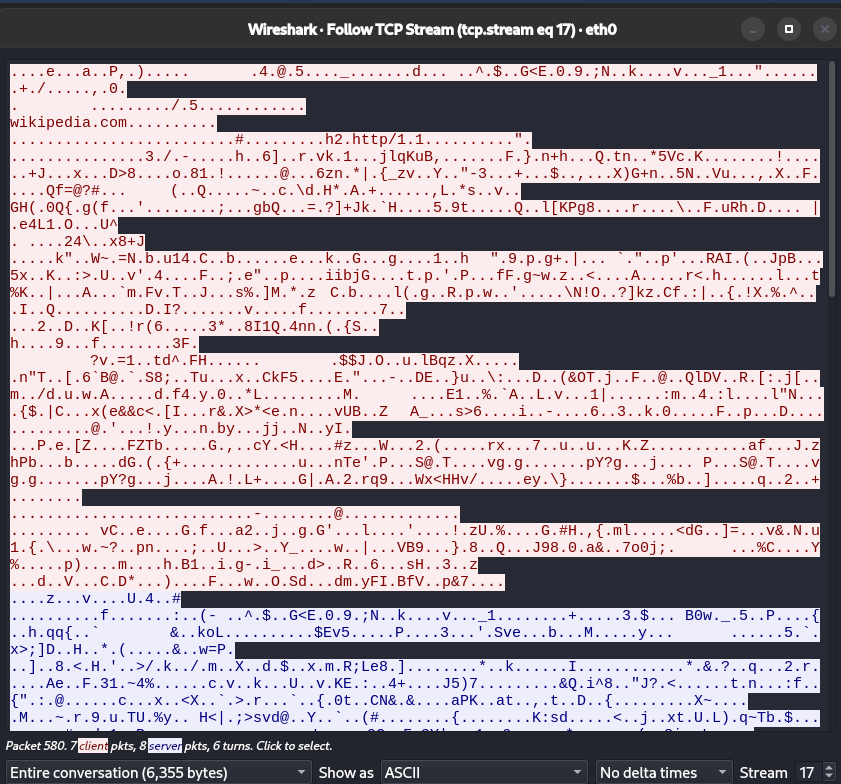

# Wireshark - HTTPS Traffic and the Full Process

## Operating System
Kali Linux

## Objective
- Capture and analyze HTTPS traffic.
- Enumerate the full process of opening a website.

---

## What happens when you open a website?

---

## 1. Open a website and capture the traffic

- Enter the website's URL.

## 2. DNS Lookup - Finding the Server

DNS Lookup Process:
1. The browser asks the DNS resolver, router or default gateway, for the HTTPS, A (IPv4), and AAAA (IPv6) records of the website server.
2. Resolver returns the HTTPS, A, and AAAA records of the server.

Observations:
- The website that I am trying to enter is visible.
- The returned website server's IP addresses are visible.

## 3. TCP Handshake - Connection establishment

The Web Traffic from Opening a Website

- Connections between the browser, from different ports, and server.

Filter connection from one source port

The TCP Handshake:
1. The browser initiates the connection by sending a SYN flag to the server.
2. The server signals that it is open for a conection via sending SYN-ACK.
3. The browser send ACK flag, establishing the connection.

Observations:
- The TCP handshake used the port 443 (HTTPS)

## 4. TLS Handshake - Encrypted Communication Establishment

The TLS Handshake (based on the traffic):
1. The browser sends Client Hello.
2. The server responds with server hello, change cipher spec, and application data.

Thoughts:
- SNI (Service Name Indicator) is showing the website's domain name.
- In theory, the process should be like this:
  1. Browser sends Client Hello and valid encryption methods.
  2. Server responds with Server Hello, digital certificate, and chosen encryption method.
  3. Browser verifies the certificate.
  4. The exchange encryption keys.
  5. Encrypted communication begins.
- However, on TLS version 1.3, the certificate is encrypted - masked with "Application Data"
- The traffic after the server hello packet was mostly "Application Data" and "ACK"
  
## 4. The HTTPS Traffic - Encrypted Communication

To analyze the contents of the HTTPS traffic:
1. Right-click the packet with TLS/HTTPS protocol
2. Click "Follow"
3. Click "TCP Stream"

Observation:
- I can see the domain name.
- The rest of the contents doesn't form a proper word/phrase.

---

## Conclusion:
- HTTP vs HTTPS

| | HTTP | HTTPS |
| --- | --- | --- |
| Visibility | Visible | Encrypted |
| Visible Contents | All | Domain Name, Source & Server IP address, time |
  
- DNS Lookup and TLS handshake give away the website I am trying to enter.
- The "Application Data" packets are the HTTPS traffic, which are encrypted web resource transfer.
- The repeated "ACK" flags were signals that the data are received.
