# Pickle Rick

## Introduction
"This Rick and Morty-themed challenge requires you to exploit a web server and find three ingredients to help Rick make his potion and transform himself back into a human from a pickle."

## Machines 

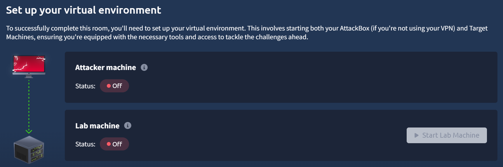

- Two machines: the attacker and the target

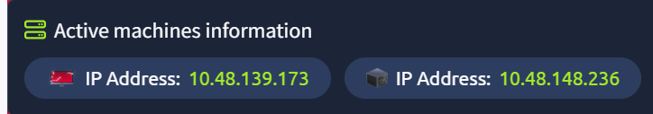

- Attacker's IP: `10.48.139.173`
- Target's IP: `10.48.148.236`

## Questions
1. What is the first ingredient that Rick needs?
2. What is the second ingredient in Rick’s potion?
3. What is the last and final ingredient?
- I need to look for the three ingedients in the web server and rick's account.

## Walkthrough

---

### Scan the Target
Command: `nmap -sT 10.48.148.236`
- This scan looks for open ports and completes the three-way handshake with the target.

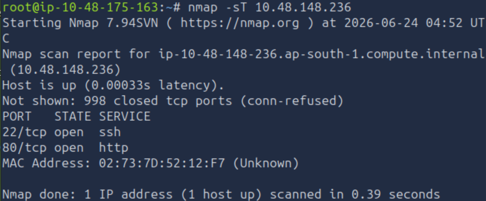

Notes:
- There are two open ports: 22 and 80, presumably ssh and http services

### Scan for Versions
Command: `nmap -sV -p 22,80 10.48.148.236`

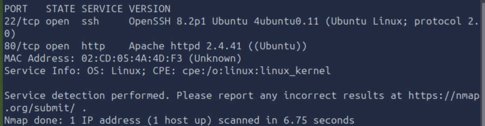

Note:
- The target is running a web server on http using Apache.

### Scan for Vulnerabilities
Command: `nmap -sC --script=vuln 10.48.148.236`

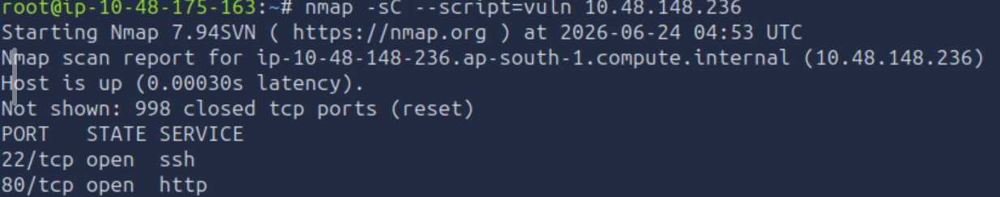

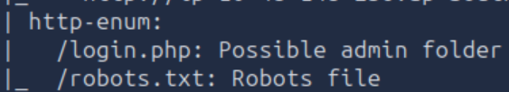

Notes:
- The scan revealed that there are two exposed files:
  1. `login.php` - a folder
  2. `robots.txt` - a critical file

### Perform HTTP Query
Command: `curl 10.48.148.236`
- This command sends a http request to the target.

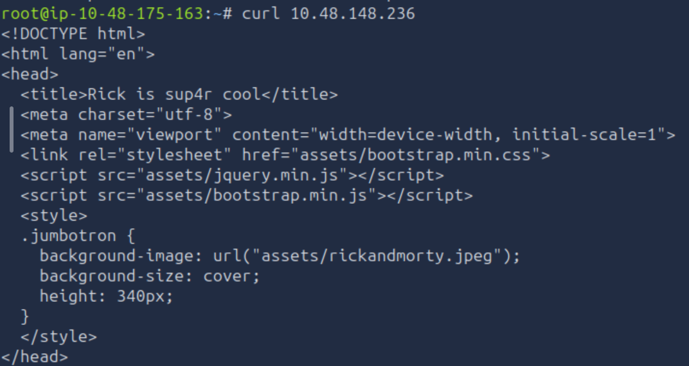

- In the body, there is a comment that revealed Rick's username for the web server.

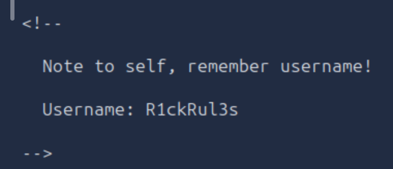

Note:
- Username: `R1ckRul3s`

### Visit the Website 
Open the browser and enter the target's Ip in the search bar to visit Rick's Website, `Rick is sup4r cool`.

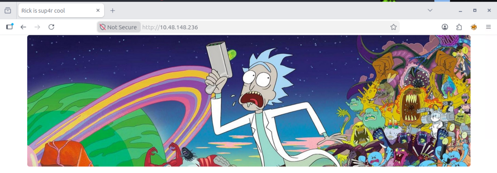

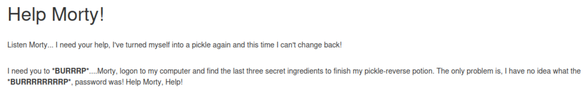

- As Morty, I need to logon to Rick's computer and find the three ingredients to turn him back into a human again.

### Visit Exposed Files
- Go to `10.48.148.236/login.php` and `10.48.148.236/robots.txt`.

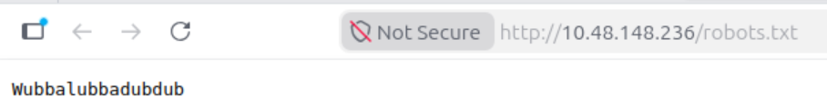

- `robots.txt` contains the string `Wubbalubbadubdub`, which is likely to be Rick's password.

- `login.php` is the login portal.

### Login
- On `login.php`'s input fields, enter:
  - Username: `R1ckRul3s`
  - Password: `Wubbalubbadubdub`
 
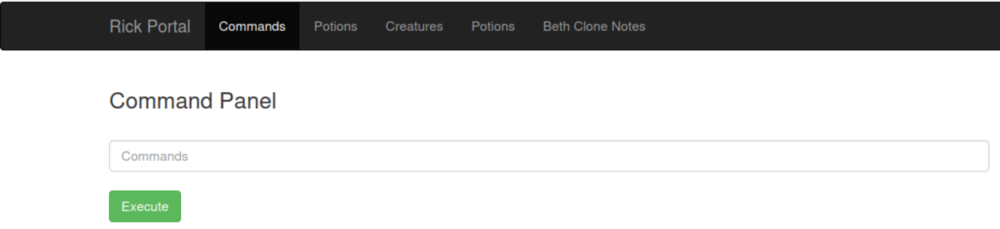

- After logging in, you'll see a command panel.

### The First Ingredient
Commands:
- `whoami` - show your username
- `pwd` - show the current working directory
- `ls` - show all the files in the current directory
- `nl [file]` - opens a text file with number lines

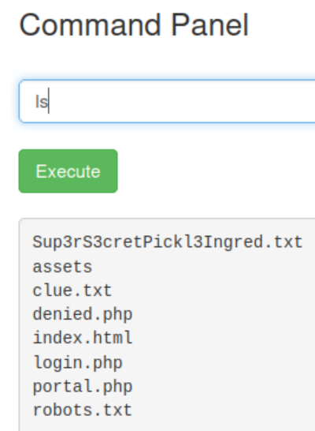

- I am logged in as `www-data`.

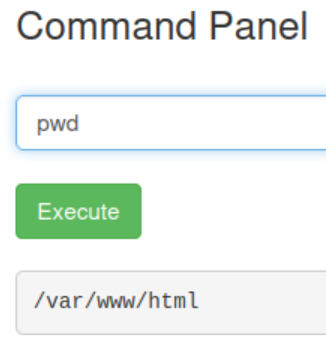

 - After logging in, the page redirected me to `/var/www/html`.

- There are 8 files in my current working directory.
- The first text file, `Sup3rS3cretPickl3ingred.txt` is the first ingredient.
- Run `nl Sup3rS3cretPickl3ingred.txt`

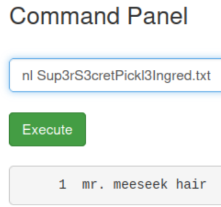

- First Ingredient: `mr. meeseek hair`

### Look for Users
Commands:
- `ls -la /home` - shows the user directories in a long list format

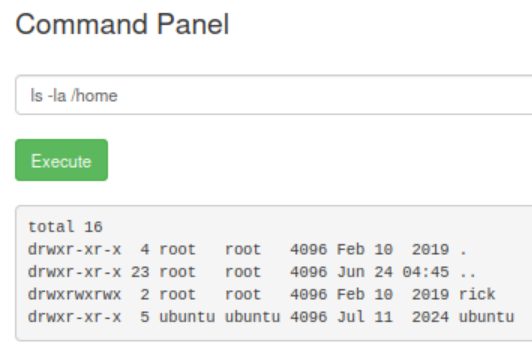

Notes: 
- two user directories:
  1. rick
  2. ubuntu
 
### The Second Ingredient
Commands:
- `ls -la /home/rick` - shows the files in rick's directory
- `nl`

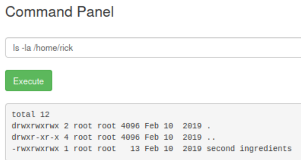

- There is the second ingredient's file.
- Run `nl /home/rick/"second ingredients"`

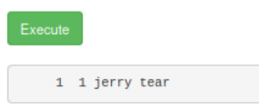

- Second Ingredient: `jerry tear`

### The Third Ingredient
Commands:
- `ls -la /home/ubuntu` - shows the files in ubuntu's directory
- `nl`

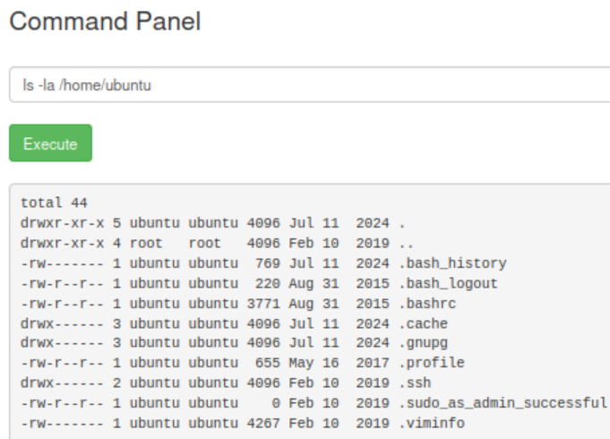

- ubuntu's directory shows the exposed `.bash_history` file, which contains the commands executed by the user ubuntu.
- Open it using the command: `sudo nl /home/ubuntu/.bash_history`

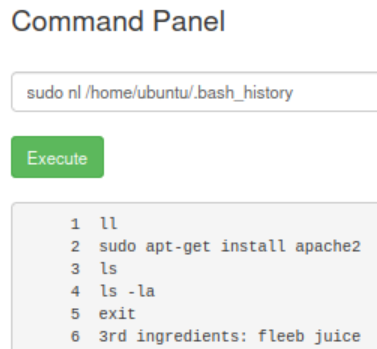

- Third Ingredient: `fleeb juice`
